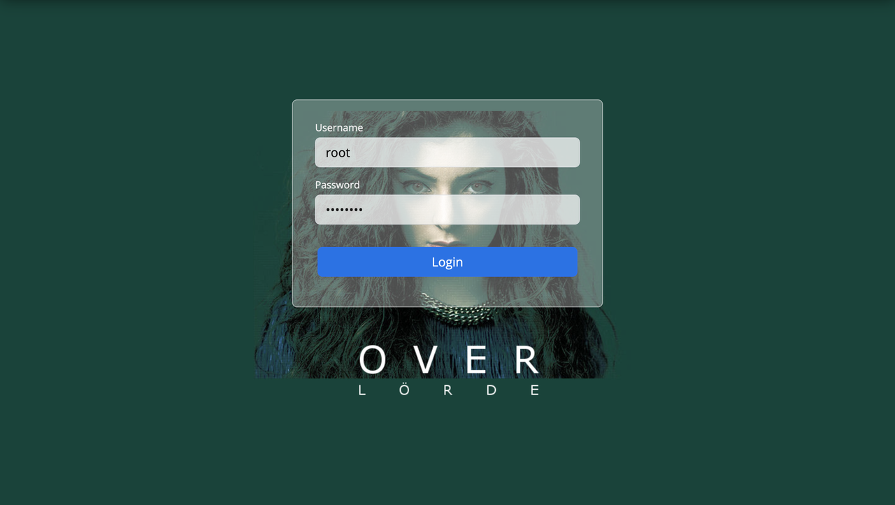
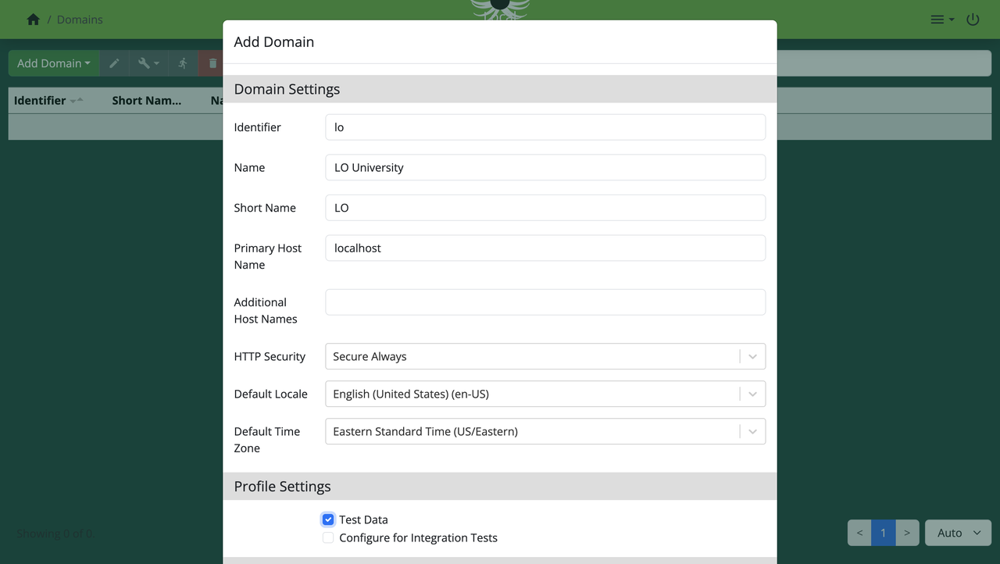
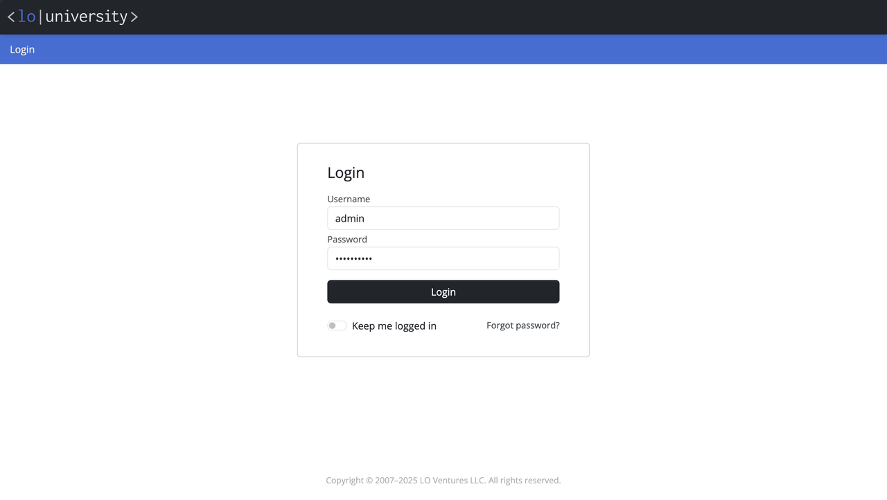
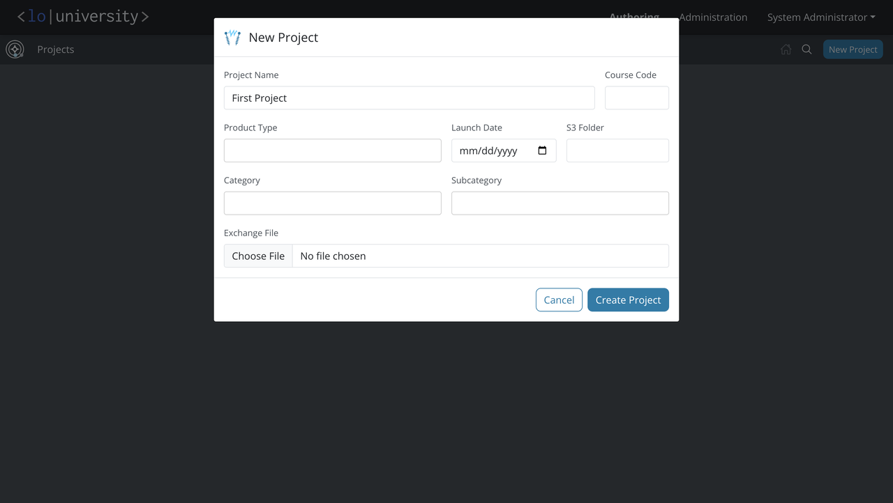
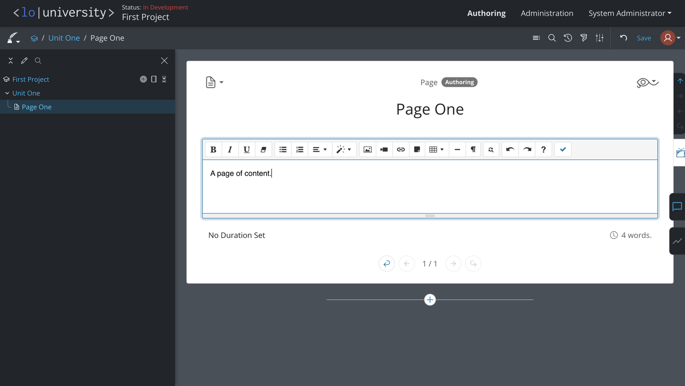
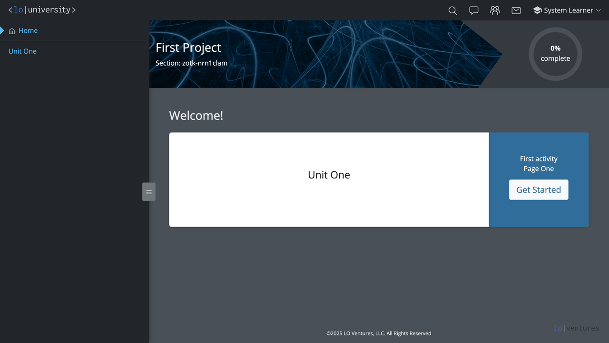

An authoring, teaching and learning environment: An AGPL-licensed open source LMS.

[](https://www.scala-lang.org/)
[](https://www.gnu.org/licenses/agpl-3.0)
[](https://github.com/loventures/loplatform/actions/workflows/main.yml)

# Getting started

## Install prerequisites

To build, you need Java 21, Node 22, SBT and Yarn.
To run, you need PostgreSQL 17, OpenSearch and Valkey/Redis.

### MacOS with Homebrew

The follow steps assume a modern macOS and Homebrew, but other OS and
environments will work too. The default configuration expects that the
required services are all available on their standard ports.

#### Build tools

```shell
% brew install openjdk@21 node@22 yarn sbt
```

Follow the instructions to add `node` and `java` to your `PATH` (or use
`nvm` or `jenv` or suchlike). Expect that `node --version` is 22
and `java --version` is 21.

#### PostgreSQL

```shell
% brew install postgresql@17
```

Follow the instructions to add PostgreSQL to your `PATH` and to
start the service.

#### OpenSearch

```shell
% brew install opensearch
```

Follow the instructions to start the service.

#### Valkey/Redis

```shell
% brew install valkey
```

Follow the instructions to start the service. Redis will also work.

## Configure the platform

The platform needs a database, a keystore and some secrets.

### Create a database

Create a database and user. You'll need to choose a password for the database user and remember it for later.

```shell
% createuser -P ug
Enter password for new role: <dbpass>
% createdb -O ug -E utf-8 underground
```

If these commands are not found, make sure you added postgres to your `PATH` above
and `source` your rc file if necessary.

### Generate a keystore

Generate a keystore for the Tomcat server. You'll need to choose a password for the keystore and remember it for later.

```shell
% keytool -genkey -keystore backend/keystore -alias localhost -dname "CN=localhost" -sigalg SHA256withRSA -keyalg RSA -validity 365
Enter keystore password: <storepass>
Re-enter new password: <storepass>
```

### Write your local config

Create a file `backend/deploy/src/main/resources/user.conf`. You will need to choose
a password for the overlord (super-admin) and test accounts and enter the keystore and
database user passwords from above:

```hocon
overlord.password = "<rootpass>"
de.strap.user.password = "<adminpass>"
keystore.password = "<storepass>"
de.databases.underground.datasource.pass = "<dbpass>"
```

If OpenSearch required an admin password for setup, add these lines:

```hocon
opensearch.username = "admin"
opensearch.password = "<ospass>"
```

## Build and publish the frontend locally

The frontend components are built using Vite and then packaged and published
locally as JAR files for convenience to the backend.

```shell
% cd frontend/
% sbt install build publishLocal
```

This builds the three frontend packages in parallel, and publishes the
resulting artifacts to your local Ivy repository.

### Building individual projects

If there are problems with the combined build step, you can build the projects individually using Yarn:

```shell
% cd frontend/authoring/ # or platform/ or courseware/
% yarn install
% yarn build
```

You still need to `sbt publishLocal` if you build individually.

## Build and start the backend

The backend is build with SBT and runs directly in an embedded Tomcat container.

```shell
% cd backend/
% sbt -J-Xmx4G
sbt:de> up
```

After a brief interlude you should see the message "CPXP ready". Log messages
are available in `logs/detomcat.json`.

## Log in as super-admin and create a domain

Navigate to:
[`https://127.0.01:8181/control/admin`](https://127.0.0.1:8181/control/admin).
You'll have to accept the HTTPS security warning.

Login using the username `root` and the _rootpass_ password you chose above.



Navigate to _Domains_, choose _Add Domain_ / _Basic Domain_.

Under _Domain Settings_ enter the following values:

- _Identifier_: `lo`
- _Name_: `LO University`
- _Short Name_: `LO`
- _Primary Host Name_: `localhost`

Under _Profile Settings_ select the _Test Data_ checkbox to create some test accounts including the local admin.



Click _Submit_ and wait for the domain to provision. You will be
launched into the administration portal for the domain.

## Log in as an admin and author some content

Navigate to:
[`https://localhost:8181/`](https://localhost:8181/).
You'll have to accept the HTTPS security warning.

Login using the username `admin` and the _adminpass_ password you chose above.



Click on the _Authoring_ tab, click _New Project_, enter a name
such as "First Project" and click _Create Project_.



Create content using the authoring environment.



Preview content using the _Eye of Horus_ menu.



---

LO Platform copyright &copy; 2007–2025 [LO Ventures LLC](https://lo.ventures/).
Released under the terms of the [AGPL-3.0](LICENSE.md).
For custom licensing, contact us at `info` @ `lo.ventures`.
For culpability, please see the [hall of blame](BLAME.md).
